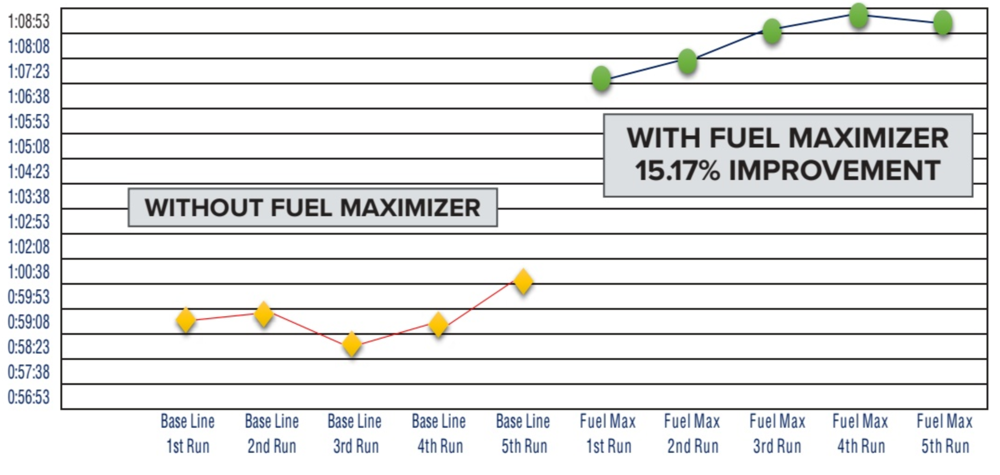

# 1. Overview

PDFSolid Conversion SDK is a high-performance library designed for extracting and transforming the data within your PDF files, such as text, images, tables, links, and annotations, into various file formats. The Conversion SDK retains the original document layout and the properties of the file data, helping you build a reliable document conversion workflow in C++ applications.

Effortlessly integrate the PDFSolid Conversion SDK into your C++ projects in just a few steps, and enable the following file format conversions:

- Convert PDF to Word (.docx)
- Convert PDF to Excel (.xlsx)
- Convert PDF to PowerPoint (.pptx)
- Convert PDF to HTML (.html)
- Convert PDF to CSV (.csv)
- Convert PDF to Image (.png, .jpg, .jpeg, .jpeg2000, .bmp, .tiff, .tga, .gif, .webp)
- Convert PDF to Plain Text (.txt)
- Convert PDF to Rich Text Format (.rtf)
- Convert PDF to Searchable PDF (.pdf)
- Convert PDF to OFD (.ofd)
- Convert PDF to Structured Data (.json)
- Convert PDF to Markdown (.md)

To enhance format conversion results, PDFSolid also provides AI-powered document tools with the following capabilities:

- Optical Character Recognition (OCR)
- Layout Analysis
- Table Recognition

## 1.1 Why PDFSolid Conversion SDK

- Mature Technology

  With years of technology accumulation, PDFSolid has established a complete mechanism of product iteration to offer a continuous guarantee for product competitiveness.

- Complete PDF and Format Conversion Functionalities

  The comprehensive feature set can meet diverse conversion needs and is easy for customers to use without training costs.

- High-quality Service

  Professional service and technical support can quickly respond to users' feedback through onsite service or remote support such as telephone and email.

- Independent Intellectual Property Rights

  The technology is independent and compliant with ISO, helping enterprises conduct international business without copyright risks.

## 1.2 PDFSolid Conversion SDK for C++

The PDFSolid Conversion SDK is designed to convert PDF files into many other formats while preserving the original layout and formatting of the documents. In this guide, we will demonstrate how to use the C++ API exported by the SDK in Windows, Linux, and macOS projects.

## 1.3 License & Trial

The PDFSolid Conversion SDK is a commercial SDK that requires a license to grant developers the right to develop and distribute their applications. In development mode, each license is only valid for one device ID. PDFSolid provides flexible licensing models. Please contact [our marketing team](mailto:support@pdfsolid.com) for more information. Even if you have a license, it is prohibited to distribute any documents, sample code, or source code of the PDFSolid Conversion SDK to any third parties.

If you do not have a license, please contact the PDFSolid Team at support@pdfsolid.com to obtain a trial license for PDFSolid Conversion SDK.

# 2. Get Started

## 2.1 Requirements

Before starting, please make sure that you have met the following prerequisites.

### 2.1.1 Get PDFSolid License Key

PDFSolid provides two types of license key: 30-day free trial license and commercial license.

#### How to Get Free Trial License

Contact our sales team at support@pdfsolid.com and we will send you a 30-day free trial license for PDFSolid Conversion SDK.

#### How to Get Commercial License

PDFSolid Conversion SDK is a commercial SDK that requires a license for application release. Any documents, sample code, or source code distribution from the released package of PDFSolid to any third party is prohibited.

To get a commercial license for PDFSolid Conversion SDK, feel free to contact our sales team at support@pdfsolid.com.

For the C++ Conversion SDK, the commercial license must be bound to your developer device ID (How to find the developer device ID), and each license is only valid for one device ID in development mode.

### 2.1.2 Download Conversion SDK

Contact us at support@pdfsolid.com to obtain the PDFSolid C++ Conversion SDK.

### 2.1.3 System Requirements

| Development Platform | System Requirements | Development Environment | Notice |
| -------------------- | ------------------- | ----------------------- | ------ |
| Windows | - Windows 7, 8, 10, and 11 (32-bit, 64-bit).<br />- C++11 or above is required. | Visual Studio 2022 or higher. | Samples have been tested on Windows 10 and 11. |
| Linux | - Linux x64.<br />- C++11 or above is required. | GCC or Clang toolchain. | Samples have been tested on Ubuntu 20.04. |
| Mac | - macOS 10.14 or higher (Intel, Apple Silicon).<br />- C++11 or above is required. | Xcode 13.0 or higher. | Samples have been tested on Mac Intel and Mac Apple Silicon. |

## 2.2 SDK Package Structure

You can contact us at support@pdfsolid.com to get the PDF format conversion SDK package. The PDFSolid Conversion C++ SDK contains the following files:

- ***"doc"*** - API reference and developer guide.
- ***"include"*** - Header files for PDFSolid Conversion SDK C++ API.
- ***"lib"*** - PDFSolid dynamic libraries for supported architectures.
- ***"resource"*** - DocumentAI model resources.
- ***"samples"*** - Sample projects and scripts.
- ***"legal.txt"*** - Legal and copyright information.
- ***"release_notes.txt"*** - Release information.

## 2.3 Apply the License Key

PDFSolid Conversion SDK currently supports offline authentication to verify license keys.

*Learn about:*

*What is the authentication mechanism of PDFSolid's license?*

### 2.3.1 Copy the License Key

Accurately obtaining the license key is crucial for applying the license.

1. In the email you received, locate the XML file containing the license key.
2. Open the XML file and determine the license type based on the `<type>` field. If `<type>online</type>` is present, it indicates an online license. If `<type>offline</type>` is present or if the field is absent, it indicates an offline license.

**Online License:**

```xml
<?xml version="1.0" encoding="UTF-8" standalone="no"?>
<license version="1">
    <platform>windows</platform>
    <starttime>xxxxxxxx</starttime>
    <endtime>xxxxxxxx</endtime>
    <type>online</type>
    <key>LICENSE_KEY</key>
</license>
```

**Offline License:**

```xml
<?xml version="1.0" encoding="UTF-8" standalone="no"?>
<license version="1">
    <platform>windows</platform>
    <starttime>xxxxxxxx</starttime>
    <endtime>xxxxxxxx</endtime>
    <key>LICENSE_KEY</key>
</license>
```

3. Copy the value located at the `LICENSE_KEY` position within the `<key>LICENSE_KEY</key>` field. This is your license key.

### 2.3.2 Apply the License Key

You can perform offline authentication using the following method:

```cpp
#include "pdfsolid_conversion.h"

using namespace pdfsolid;
using namespace pdfsolid::base;
using namespace pdfsolid::common;
using namespace pdfsolid::conversion;

const char* license = "LICENSE_KEY";
ErrorCode code = LibraryManager::LicenseVerify(license, "device_id", "app_id");
if (code != ErrorCode::e_ErrSuccess) {
    return code;
}
```

Before calling any conversion API, initialize the SDK resource directory:

```cpp
#include "pdfsolid_conversion.h"

using namespace pdfsolid::common;

LibraryManager::Initialize("PDFSolid_Conversion_SDK/resource");
```

## 2.4 How to Run a Demo

### 2.4.1 Windows

PDFSolid Conversion SDK provides a demo in the ***"samples"*** folder. You can follow these steps to run the demo:

1. Load the Visual Studio solution file ***"demo_vs2022.sln"*** in the ***"samples"*** folder.
2. Build the demo by clicking **Build > Build Solution**. After the build is completed, the executable file ***".exe"*** will be generated in the ***"samples/bin"*** folder. The executable file name depends on the build configuration.
3. Double-click the executable file to run the demo.

Output files such as Word, Excel, and PowerPoint files will be generated in the ***"samples/output_files"*** folder.

### 2.4.2 Linux and Mac

PDFSolid Conversion SDK provides demos in the ***"samples"*** folder. Before running the demo, make sure you have configured your environment correctly and installed CMake 3.0 or higher. To run the demo, follow these steps:

1. Open a terminal window and navigate to the ***"samples"*** folder of the PDFSolid Conversion SDK package.
2. Enter the following command to run the demo.

```shell
./RunDemo.sh
```

Output files such as Word, Excel, and PowerPoint files will be generated in the ***"samples/output_files"*** folder.

# 3. Conversion Guides

PDFSolid Conversion SDK allows developers to use simple C++ APIs to convert PDFs to common formats such as Word, Excel, PowerPoint, HTML, CSV, PNG, JPEG, RTF, TXT, Searchable PDF, OFD, JSON, and Markdown. It also provides conversion options, such as whether to include images or annotations, whether to enable OCR, and whether to enable layout analysis.

## 3.1 Initialize Library Resources

### Overview

Initialize the necessary file and memory resources required by the PDFSolid Conversion SDK.

### Notes

- You must initialize SDK resources before calling any conversion interface.
- When using OCR, Layout Analysis, Table Recognition, PDF to Searchable PDF, or PDF to OFD, make sure the DocumentAI model resources in the `resource` directory are available.

### Example

```cpp
LibraryManager::Initialize("PDFSolid_Conversion_SDK/resource");
```

## 3.2 Set DocumentAI Model

### Overview

Before using OCR, Layout Analysis, Table Recognition, PDF to Searchable PDF, or PDF to OFD, set the DocumentAI model path first.

`SetDocumentAIModel` supports the `gpu_id` parameter to specify the GPU device index for the AI model. When `gpu_id` is `-1`, GPU acceleration is disabled.

### Example

```cpp
ErrorCode code = LibraryManager::SetDocumentAIModel("path/documentai.model", -1);
if (code != ErrorCode::e_ErrSuccess) {
    return code;
}
```

### Set AI Model Instance Count

If you need to control the number of Layout Analysis and Table Recognition model instances, call the following interface:

```cpp
LibraryManager::SetDocumentAIModelCount(1, 1);
```

The first parameter indicates the number of Layout Analysis model instances, and the second parameter indicates the number of Table Recognition model instances.

### Use Your Own AI Engine (SDK v4.1.0+)

This option is available only in SDK v4.1.0 or later. If you prefer to run OCR, Layout Analysis, or Table Recognition with your own model or a third-party service instead of the bundled DocumentAI model, the SDK exposes callback hooks on `CConvertCallback` that let you supply the results as JSON. See [3.11 Use Custom AI Models via Callbacks](#311-use-custom-ai-models-via-callbacks) for details. When all capabilities you need are covered by your own callbacks, `SetDocumentAIModel` does not have to be called.

## 3.3 Get Conversion Progress

PDFSolid Conversion SDK obtains conversion progress through the `progress` callback in `CConvertCallback`. The following example demonstrates how to get conversion progress while performing a PDF to Word task:

```cpp
#include <iostream>

#include "pdfsolid_conversion.h"

using namespace pdfsolid::base;
using namespace pdfsolid::conversion;

void Progress(int current_page_count, int total_page_count)
{
    std::cout << "progress: " << current_page_count << " / " << total_page_count << std::endl;
}

ConvertOptions opt;

CConvertCallback callback = {};
callback.progress = Progress;

CPDFConversion::StartPDFToWord("input.pdf", "password", "path/output.docx", opt, &callback);
```

The `handle` field is maintained internally by the SDK during conversion, so it should be initialized to `nullptr` when passed in.

## 3.4 Cancel Conversion Task

PDFSolid Conversion SDK supports interrupting an ongoing conversion task through the `cancel` callback in `CConvertCallback`. When the `cancel` callback returns `true`, the current conversion task stops as soon as possible.

```cpp
bool Cancel()
{
    return false;
}

ConvertOptions opt;

CConvertCallback callback = {};
callback.cancel = Cancel;

CPDFConversion::StartPDFToWord("input.pdf", "password", "path/output.docx", opt, &callback);
```

If you need to cancel the conversion at a specific time, return `true` from `Cancel` based on external state.

## 3.5 Select Page Range for Conversion

PDFSolid Conversion SDK supports converting a specified page range. When an empty string is passed, all pages will be converted. If the page range exceeds one page, you can enable `output_document_per_page` to output each PDF page as a separate file.

```cpp
ConvertOptions opt;
opt.output_document_per_page = true;
strcpy(opt.page_ranges, "1-3,5,7-9");
```

## 3.6 Contain Image and Annotation Options

### Overview

When converting PDF documents into various formats, PDFSolid Conversion SDK offers two common options: whether images are included in the generated document, and whether annotations from the PDF file are retained.

- When `contain_image` is enabled, the SDK extracts images from the PDF document and embeds them in the corresponding pages and positions in the output file. For areas with overlapping images, the SDK merges these images into one image and embeds it at the correct location.
- When `contain_annotation` is enabled, most annotations are converted into raster images and embedded at the corresponding positions. Certain types of annotations, such as highlights, underlines, strikeouts, and squiggly lines, are converted into native formatting equivalents in Word, PowerPoint, and HTML documents when possible.

These options are commonly used in the following conversions:

- PDF to Word
- PDF to Excel
- PDF to PowerPoint
- PDF to HTML
- PDF to RTF
- Extract PDF to JSON
- Extract PDF to Markdown

### Sample

```cpp
ConvertOptions opt;
opt.contain_image = true;
opt.contain_annotation = true;

CPDFConversion::StartPDFToWord("input.pdf", "password", "path/output.docx", opt);
```

## 3.7 Page Layout Mode

In certain formats, the page layout mode plays a key role in the quality of the converted document. PDFSolid Conversion SDK supports two layout modes: Flow Layout and Box Layout.

- **Flow Layout:** This layout uses paragraph indentations, columns, and tab positions to adjust content. Its main advantage is flexibility. Content can flow automatically as the document is edited and can adapt to different screen sizes.
- **Box Layout:** This layout is based on the PDF fixed-page model and accurately positions text, images, and tables on the page using coordinates. It is useful for documents that require high-precision reproduction, such as contracts, design drafts, and academic papers.

Page layout modes are commonly used in the following conversions:

- PDF to Word
- PDF to HTML

### Sample

```cpp
ConvertOptions opt;

opt.page_layout_mode = PageLayoutMode::e_Flow;
CPDFConversion::StartPDFToWord("input.pdf", "password", "path/flow.docx", opt);

opt.page_layout_mode = PageLayoutMode::e_Box;
CPDFConversion::StartPDFToWord("input.pdf", "password", "path/box.docx", opt);
```

## 3.8 OCR

### Overview

OCR (Optical Character Recognition) converts images of typed, handwritten, or printed text into machine-encoded text.

OCR is commonly used for text recognition and extraction from the following types of documents:

- Non-editable scanned PDF files.
- Photographs of documents.
- Scene photos such as advertising layouts and signboards.
- Identification cards, passports, vehicle license plates, invoices, bills, and receipts.

The following features support OCR:

- PDF to Word
- PDF to Excel
- PDF to PowerPoint
- PDF to HTML
- PDF to RTF
- PDF to TXT
- PDF to CSV
- PDF to Searchable PDF
- PDF to OFD
- Extract PDF to JSON
- Extract PDF to Markdown

### OCR Language

Pass OCR languages through `ConvertOptions::languages` and set `ConvertOptions::language_count` for each conversion task.

```cpp
ConvertOptions opt;
opt.enable_ocr = true;
opt.languages[0] = OCRLanguage::e_English;
opt.language_count = 1;

CPDFConversion::StartPDFToWord("word.pdf", "password", "path/output.docx", opt);
```

Supported C++ enum values include:

| Enum | Description |
| ---- | ----------- |
| `OCRLanguage::e_Chinese` | Chinese Simplified |
| `OCRLanguage::e_ChineseTra` | Chinese Traditional |
| `OCRLanguage::e_English` | English |
| `OCRLanguage::e_Korean` | Korean |
| `OCRLanguage::e_Japanese` | Japanese |
| `OCRLanguage::e_Latin` | Latin script languages |
| `OCRLanguage::e_Devanagari` | Devanagari |
| `OCRLanguage::e_Cyrillic` | Cyrillic |
| `OCRLanguage::e_Arabic` | Arabic |
| `OCRLanguage::e_Tamil` | Tamil |
| `OCRLanguage::e_Telugu` | Telugu |
| `OCRLanguage::e_Kannada` | Kannada |
| `OCRLanguage::e_Thai` | Thai |
| `OCRLanguage::e_Greek` | Greek |
| `OCRLanguage::e_Eslav` | Eslav |
| `OCRLanguage::e_Auto` | Automatically select language |

### OCR Options

Different OCR options can be selected according to actual needs:

- `OCROption::e_InvalidCharacter`: Recognizes invalid or garbled characters in the PDF document through OCR, while normal characters are not processed by OCR.
- `OCROption::e_ScanPage`: Recognizes scanned pages in the PDF document through OCR, while editable pages are not processed by OCR.
- `OCROption::e_InvalidCharacterAndScanPage`: Recognizes both invalid characters and scanned pages in the PDF document through OCR.
- `OCROption::e_All`: Recognizes all pages and characters in the PDF document through OCR.

### Preserve Page Background

When OCR is enabled, you can enable `contain_page_background_image` to preserve the original page background image of the PDF. If it is disabled, the image result detected during page layout analysis will be retained.

### Notice

- The quality of the OCR result depends on the quality of the input image. A good rule of thumb is that the more pixels in the character shapes, the better. The ideal image is a grayscale image with a resolution around 300 DPI.
- When performing OCR, make sure the OCR language setting matches the language in the PDF document to achieve the best OCR conversion quality.
- OCR functionality currently does not support operating systems lower than Windows 10.

### Converting Images to Other Document Formats

The OCR function also supports converting input images into Word, Excel, PowerPoint, HTML, CSV, RTF, TXT, JSON, and other formats.

```cpp
LibraryManager::SetDocumentAIModel("path/documentai.model", -1);

ConvertOptions opt;
opt.enable_ocr = true;
opt.languages[0] = OCRLanguage::e_English;
opt.language_count = 1;

CPDFConversion::StartPDFToWord("input.png", "", "path/output.docx", opt);
```

## 3.9 Layout Analysis

### Overview

Layout analysis uses AI technology to parse and understand the structure of a document layout. It extracts text, images, tables, layers, and other data from input documents.

Features that support Layout Analysis:

- PDF to Word
- PDF to Excel
- PDF to PowerPoint
- PDF to HTML
- PDF to RTF
- PDF to TXT
- PDF to CSV
- Extract PDF to JSON
- Extract PDF to Markdown

### Notice

- You need to load the DocumentAI model before using layout analysis, or plug in your own AI engine via callbacks described in [3.11 Use Custom AI Models via Callbacks](#311-use-custom-ai-models-via-callbacks).
- When OCR is enabled, layout analysis is automatically enabled.
- AI table recognition is a separate stage controlled by `enable_ai_table_recognition`.

### Sample

```cpp
LibraryManager::SetDocumentAIModel("path/documentai.model", -1);

ConvertOptions opt;
opt.enable_ai_layout = true;

CPDFConversion::StartPDFToWord("word.pdf", "password", "path/output.docx", opt);
```

## 3.10 Table Recognition

### Overview

Table Recognition reconstructs the internal structure of tables detected during layout analysis, including rows, columns, merged cells, and cell boundaries, so that the converted document preserves the original tabular semantics instead of producing a flat grid of text fragments.

It is controlled by the independent option `enable_ai_table_recognition`, which is enabled by default. The table model is invoked for table regions detected by layout analysis.

Typical scenarios that benefit from Table Recognition:

- Borderless or partially bordered tables.
- Tables with merged header cells, multi-row headers, or spanning cells.
- Scanned tables processed by OCR.

### Notice

- Table Recognition runs only when layout analysis is active, either through `enable_ai_layout = true` or implicitly through `enable_ocr = true`.
- You need to load the DocumentAI model before using Table Recognition, or plug in your own table model via callbacks described in [3.11 Use Custom AI Models via Callbacks](#311-use-custom-ai-models-via-callbacks).
- Set `enable_ai_table_recognition = false` to disable the table model.
- The number of Table Recognition model instances can be tuned through the second parameter of `SetDocumentAIModelCount`.

### Sample

```cpp
LibraryManager::SetDocumentAIModel("path/documentai.model", -1);

ConvertOptions opt;
opt.enable_ai_layout = true;
opt.enable_ai_table_recognition = true;

CPDFConversion::StartPDFToWord("word.pdf", "password", "path/output.docx", opt);
```

## 3.11 Use Custom AI Models via Callbacks

### Overview

Starting with SDK v4.1.0, PDFSolid Conversion SDK exposes a callback-based extension point that lets you plug in your own AI inference engine for OCR, Layout Analysis, and Table Recognition. Instead of relying on the built-in DocumentAI model loaded by `SetDocumentAIModel`, you can run inference with any model or service and return the result to the SDK as a JSON string.

When the relevant callback pair is registered on `CConvertCallback`, the SDK skips its built-in model invocation for that capability and consumes your JSON output instead. If a pair is left as `nullptr`, the SDK falls back to the built-in DocumentAI model when available.

### Callback Pairs

Each AI capability uses two callbacks: a trigger callback invoked by the SDK with the path to a page image saved as PNG in a temporary directory, and a result getter invoked by the SDK immediately afterwards to retrieve the JSON string.

| Capability | Trigger callback | Result getter callback | Triggered when |
| ---------- | ---------------- | ---------------------- | -------------- |
| OCR | `ocr` | `get_ocr_result` | `enable_ocr = true` |
| Layout Analysis | `layout` | `get_layout_result` | `enable_ai_layout = true` or `enable_ocr = true` |
| Table Recognition | `table` | `get_table_result` | `enable_ai_table_recognition = true` and a table region is detected by layout analysis |

Rules:

- The trigger receives a UTF-8 path to a PNG file. Return `true` if inference succeeded, or `false` to make the SDK ignore the result for that page.
- The getter must return a UTF-8 JSON C string. The pointer must remain valid until the SDK has finished parsing it, usually until the next call to the same getter.
- Both callbacks for a capability must be set together. If only one is provided, the SDK falls back to the built-in path.
- Coordinates in your JSON must be in the pixel space of the image received by the trigger, with top-left origin, X to the right, and Y down.

### Sample

```cpp
#include <cstddef>

#include "pdfsolid_conversion.h"

using namespace pdfsolid::base;
using namespace pdfsolid::common;
using namespace pdfsolid::conversion;

static char g_ocr_json[4096];
static char g_layout_json[4096];
static char g_table_json[4096];

static bool MyOcrTrigger(const char* image_path)
{
    return RunMyOcrModel(image_path, g_ocr_json, sizeof(g_ocr_json));
}

static const char* MyOcrGetter()
{
    return g_ocr_json;
}

static bool MyLayoutTrigger(const char* image_path)
{
    return RunMyLayoutModel(image_path, g_layout_json, sizeof(g_layout_json));
}

static const char* MyLayoutGetter()
{
    return g_layout_json;
}

static bool MyTableTrigger(const char* image_path)
{
    return RunMyTableModel(image_path, g_table_json, sizeof(g_table_json));
}

static const char* MyTableGetter()
{
    return g_table_json;
}

int main()
{
    LibraryManager::LicenseVerify("LICENSE_KEY", "device_id", "app_id");
    LibraryManager::Initialize("resource");

    CConvertCallback callback = {};
    callback.ocr = MyOcrTrigger;
    callback.get_ocr_result = MyOcrGetter;
    callback.layout = MyLayoutTrigger;
    callback.get_layout_result = MyLayoutGetter;
    callback.table = MyTableTrigger;
    callback.get_table_result = MyTableGetter;

    ConvertOptions opt;
    opt.enable_ocr = true;
    opt.enable_ai_layout = true;
    opt.languages[0] = OCRLanguage::e_English;
    opt.language_count = 1;

    CPDFConversion::StartPDFToWord("input.pdf", "", "output.docx", opt, &callback);
    LibraryManager::Release();
    return 0;
}
```

You can register only the capabilities you want to override and leave others as `nullptr` to keep the built-in behavior.

### Thread Safety and Lifetime

- Callbacks are invoked from the SDK conversion thread. Implement them in a thread-safe manner if your model engine is shared across calls.
- The PNG image at `image_path` lives in the SDK temporary directory and may be deleted shortly after the trigger returns. Copy or process it before returning.
- The JSON pointer returned from a getter must remain valid until the same getter is called again or until the conversion task ends.

### OCR Result JSON Schema

Returned by `get_ocr_result`. The SDK populates each `text_spans[].chars[]` either from `words[]` if provided, or by uniformly splitting the span rect.

```json
{
  "text_spans": [
    {
      "text": "Hello World",
      "confidence": 0.98,
      "rotation": 0.0,
      "rect": { "left": 120, "top": 80, "right": 320, "bottom": 110 },
      "style": {
        "font_size": 18.0,
        "font_color": { "r": 0, "g": 0, "b": 0 }
      },
      "words": [
        { "text": "Hello", "rect": { "left": 120, "top": 80, "right": 200, "bottom": 110 } },
        { "text": "World", "rect": { "left": 210, "top": 80, "right": 320, "bottom": 110 } }
      ]
    }
  ]
}
```

| Field | Type | Required | Description |
| ----- | ---- | -------- | ----------- |
| `text_spans` | array | Yes | Recognized text spans on the page. |
| `text` | string | Yes | UTF-8 text content of the span. |
| `confidence` | number | No | 0.0 - 1.0. Spans below 0.1 are discarded. |
| `rotation` | number | No | Text rotation in degrees. Default 0. |
| `rect` | object | Yes | Bounding box in image pixels (`left`/`top`/`right`/`bottom`). |
| `style.font_size` | number | No | Estimated font size in pixels. |
| `style.font_color` | object | No | `{ r, g, b }` 0 - 255. |
| `words` | array | No | Per-word boxes. If omitted, the SDK splits the span rect evenly. Strongly recommended for CJK + Latin mixed lines for correct glyph spacing. |

### Layout Analysis Result JSON Schema

Returned by `get_layout_result`. Objects with `confidence < 0.45` are discarded.

```json
{
  "objects": [
    { "type": "title", "confidence": 0.95, "rect": { "left": 60, "top": 50, "right": 540, "bottom": 90 } },
    { "type": "paragraph", "confidence": 0.97, "rect": { "left": 60, "top": 100, "right": 540, "bottom": 220 } },
    { "type": "figure", "confidence": 0.92, "rect": { "left": 80, "top": 240, "right": 520, "bottom": 460 } },
    { "type": "table", "confidence": 0.93, "rect": { "left": 60, "top": 480, "right": 540, "bottom": 700 } }
  ]
}
```

Supported `type` values:

| Value | Meaning |
| ----- | ------- |
| `paragraph` | Body text paragraph |
| `title` | Heading |
| `figure` | Image or figure |
| `figure_title` | Figure caption header |
| `figure_caption` | Figure caption text |
| `table` | Table region. Whether the table is bordered or borderless is determined by the table recognition stage, not by the layout label. |
| `table_title` | Table caption header |
| `table_caption` | Table caption text |
| `ordered_list` | Ordered list |
| `unordered_list` | Unordered list |
| `catalogue` | Table of contents |
| `formula` | Math formula |
| `code` | Code block |
| `algorithm` | Algorithm block |
| `header` | Page header |
| `footer` | Page footer |
| `page_number` | Page number |
| `reference` | Reference or citation |

Objects with a `type` value that is not listed above are ignored. Use the values in this table as the canonical layout labels in your custom output.

### Table Recognition Result JSON Schema

Returned by `get_table_result` once per detected table region. Polygons use eight integers `[x0, y0, x1, y1, x2, y2, x3, y3]` in the order top-left, top-right, bottom-right, bottom-left.

```json
{
  "type": "table_with_line",
  "position": [60, 480, 540, 480, 540, 700, 60, 700],
  "rows": 3,
  "cols": 2,
  "angle": 0.0,
  "height_of_rows": [40, 60, 60],
  "width_of_cols": [200, 280],
  "table_cells": [
    {
      "start_row": 0,
      "end_row": 0,
      "start_col": 0,
      "end_col": 0,
      "cell_background_color_r": 240,
      "cell_background_color_g": 240,
      "cell_background_color_b": 240,
      "position": [60, 480, 260, 480, 260, 520, 60, 520]
    }
  ]
}
```

| Field | Type | Description |
| ----- | ---- | ----------- |
| `type` | string | `table_with_line` for bordered tables; any other value is treated as a non-standard (borderless) table. |
| `position` | int[8] | Table polygon in image pixels. |
| `rows` / `cols` | int | Row / column counts. |
| `angle` | number | Skew angle in degrees. |
| `height_of_rows` | int[] | Per-row pixel heights (length = `rows`). |
| `width_of_cols` | int[] | Per-column pixel widths (length = `cols`). |
| `table_cells[]` | array | One entry per merged cell. |
| `start_row` / `end_row` | int | Inclusive row span of the cell. |
| `start_col` / `end_col` | int | Inclusive column span of the cell. |
| `cell_background_color_*` | int | Cell background color components (0 - 255). |
| `position` | int[8] | Cell polygon in image pixels. |

### Tip: Validate Your JSON

If you need a reference output to compare against, run a conversion once with the built-in DocumentAI model. The SDK uses the same JSON shape internally, so your custom output should follow the same structure.

## 3.12 Output Font Option

### Overview

In some output formats, you can set the preferred font name to unify the default font style in the output document.

### Supported Formats

The `font_name` option currently applies to the following formats:

- PDF to Word
- PDF to Excel
- PDF to PowerPoint
- PDF to Searchable PDF
- PDF to OFD

For Searchable PDF and OFD, `font_name` controls the font used for the invisible or visible text layer that is overlaid on the page background. For Word, Excel, and PowerPoint, it sets the preferred default font of the generated document.

### Example

```cpp
ConvertOptions opt;
strcpy(opt.font_name, "Arial");

CPDFConversion::StartPDFToWord("word.pdf", "password", "path/output.docx", opt);
```

## 3.13 Convert PDF to Word

### Overview

Converting PDF to Word converts a PDF file into an editable Word file. You can edit, modify, insert, or delete text and pictures, and adjust layout and properties.

### Sample

```cpp
ConvertOptions opt;

opt.page_layout_mode = PageLayoutMode::e_Box;
CPDFConversion::StartPDFToWord("word.pdf", "password", "path/output_box.docx", opt);

opt.page_layout_mode = PageLayoutMode::e_Flow;
CPDFConversion::StartPDFToWord("word.pdf", "password", "path/output_flow.docx", opt);
```

### Convert Formulas to Images

When a document contains complex formulas and you want to preserve visual consistency in the output document, enable `formula_to_image`.

```cpp
ConvertOptions opt;
opt.formula_to_image = true;

CPDFConversion::StartPDFToWord("word.pdf", "password", "path/output.docx", opt);
```

## 3.14 Convert PDF to Excel

### Overview

PDFSolid Conversion SDK supports converting PDF documents to Microsoft Excel format (.xlsx). By extracting, parsing, and importing data from PDF into Excel, users can further edit, analyze, or share Excel files.

### Excel Options

When converting PDF files to Excel files, pay attention to the following options:

- `excel_all_content`: If enabled, the converted XLSX file contains all content in the PDF.
- `excel_worksheet_option`: Controls how worksheets are created.

| Option | Description |
| ------ | ----------- |
| `ExcelWorksheetOption::e_ForTable` | Create one sheet for one table. |
| `ExcelWorksheetOption::e_ForPage` | Create one sheet for one PDF page. |
| `ExcelWorksheetOption::e_ForDocument` | Create one sheet for the entire PDF document. |

### Sample

```cpp
ConvertOptions opt;
CPDFConversion::StartPDFToExcel("excel.pdf", "password", "path/output.xlsx", opt);

opt.excel_all_content = true;
opt.excel_worksheet_option = ExcelWorksheetOption::e_ForDocument;
CPDFConversion::StartPDFToExcel("excel.pdf", "password", "path/output_all.xlsx", opt);
```

## 3.15 Convert PDF to PowerPoint

### Overview

PDFSolid Conversion SDK converts PDF files to PowerPoint files and restores the layout and format of the original document for presentation and editing in Microsoft PowerPoint.

### Sample

```cpp
ConvertOptions opt;
CPDFConversion::StartPDFToPpt("ppt.pdf", "password", "path/output.pptx", opt);
```

## 3.16 Convert PDF to HTML

### Overview

PDFSolid Conversion SDK converts PDF files to HTML files while maintaining the layout and format of the original document, allowing users to browse and view the document on the web.

### HTML Options

| Option | Description |
| ------ | ----------- |
| `HtmlOption::e_SinglePage` | Convert the entire PDF file into a single HTML file. |
| `HtmlOption::e_SinglePageWithBookmark` | Convert the PDF file into a single HTML file with an outline for navigation at the beginning of the HTML page. |
| `HtmlOption::e_MultiPage` | Convert the PDF file into multiple HTML files. |
| `HtmlOption::e_MultiPageWithBookmark` | Convert the PDF file into multiple HTML files with an outline HTML file for navigation. |

### Sample

```cpp
ConvertOptions opt;
CPDFConversion::StartPDFToHtml("html.pdf", "password", "path/output.html", opt);

opt.page_layout_mode = PageLayoutMode::e_Box;
opt.html_option = HtmlOption::e_MultiPageWithBookmark;
CPDFConversion::StartPDFToHtml("html.pdf", "password", "path/output_multi.html", opt);
```

## 3.17 Convert PDF to CSV

### Overview

PDFSolid Conversion SDK supports converting PDF documents to CSV (Comma-Separated Values). This is commonly used to extract tabular or structured data from PDF documents.

CSV conversion uses the Excel conversion API with `excel_csv_format = true`.

### Automatically Create Folders

When multiple CSV files may be output, control whether to automatically create folders through `auto_create_folder`. When this option is enabled, a folder with the same name as the output file will be created in the output path to store the CSV files.

### Sample

```cpp
ConvertOptions opt;
opt.excel_csv_format = true;

CPDFConversion::StartPDFToExcel("csv.pdf", "password", "path/output.csv", opt);

opt.excel_worksheet_option = ExcelWorksheetOption::e_ForDocument;
CPDFConversion::StartPDFToExcel("csv.pdf", "password", "path/output_merged.csv", opt);
```

## 3.18 Convert PDF to Image

### Overview

PDFSolid Conversion SDK provides an API for converting PDF to images.

### Setting Image Formats

Supported image formats include:

- JPG
- JPEG
- JPEG2000
- PNG
- BMP
- TIFF
- TGA
- GIF
- WEBP

### Setting Image Color Modes

Supported image color modes include:

- `ImageColorMode::e_Color`: Color mode, where the image effect is consistent with the original PDF page.
- `ImageColorMode::e_Gray`: Grayscale mode.
- `ImageColorMode::e_Binary`: Black and white mode.

### Setting Image Scaling

The SDK supports setting image scaling. If you want to double the image size, set `image_scaling` to `2.0`; to reduce the image size by half, set `image_scaling` to `0.5`.

### Enhancing Image Path Display

The SDK supports `image_path_enhance` for enhancing the display of image paths. This option can be enabled when you want to improve the display effect of paths within the PDF page.

- Disable `image_path_enhance` option:
  
- Enable `image_path_enhance` option:
  

### Notice

- A higher `image_scaling` value results in images with higher resolution, but it also increases memory usage and slows down conversion.
- A higher `image_scaling` value does not necessarily mean higher clarity. The clarity also depends on the original image resolution in the document.

### Sample

```cpp
ConvertOptions opt;

opt.image_type = ImageType::e_JPEG;
CPDFConversion::StartPDFToImage("jpeg.pdf", "password", "path/output", opt);

opt.image_type = ImageType::e_PNG;
opt.image_scaling = 2.0;
CPDFConversion::StartPDFToImage("png.pdf", "password", "path/output", opt);
```

## 3.19 Convert PDF to RTF

### Overview

RTF is a popular text format that can retain text format and style data and is convenient for most text readers to read and write.

### Sample

```cpp
ConvertOptions opt;
CPDFConversion::StartPDFToRtf("rtf.pdf", "password", "path/output.rtf", opt);
```

## 3.20 Convert PDF to TXT

### Overview

When you need to extract text content from a PDF file for data analysis, text mining, or information retrieval, PDFSolid Conversion SDK can extract the text into a TXT file.

### Preserving Table Format

The SDK supports `txt_table_format` to preserve the table format when writing the TXT file. It is generally recommended to enable this option, especially for data extraction scenarios.

### Sample

```cpp
ConvertOptions opt;
opt.txt_table_format = true;

CPDFConversion::StartPDFToTxt("txt.pdf", "password", "path/output.txt", opt);
```

## 3.21 Convert PDF to Searchable PDF

### Overview

Searchable PDF conversion adds an invisible or visible text layer to an image-based PDF, such as a scanned document, using OCR.

### Set Transparent Text Layer

When outputting a searchable PDF, use `transparent_text` to control whether the text layer is transparent.

### Sample

```cpp
LibraryManager::SetDocumentAIModel("path/documentai.model", -1);

ConvertOptions opt;
opt.enable_ocr = true;
opt.languages[0] = OCRLanguage::e_English;
opt.language_count = 1;
opt.transparent_text = true;

CPDFConversion::StartPDFToSearchablePdf("scan.pdf", "password", "path/output.pdf", opt);
```

## 3.22 Convert PDF to OFD

### Overview

PDFSolid Conversion SDK supports converting PDF documents to OFD documents. Similar to Searchable PDF, OFD conversion also supports OCR, page background preservation, and transparent text layers.

### Notice

- If you need to generate searchable OFD output, enable `transparent_text`.
- When `enable_ocr` is enabled, specify the OCR language through `languages`.

### Sample

```cpp
LibraryManager::SetDocumentAIModel("path/documentai.model", -1);

ConvertOptions opt;
opt.enable_ocr = true;
opt.languages[0] = OCRLanguage::e_English;
opt.language_count = 1;
opt.contain_page_background_image = true;
opt.transparent_text = true;

CPDFConversion::StartPDFToOfd("scan.pdf", "password", "path/output.ofd", opt);
```

## 3.23 Releasing Library Resources

### Overview

Release the file and memory resources occupied by the PDFSolid Conversion SDK.

### Notice

- After calling `Release`, the PDFSolid Conversion SDK will no longer function properly and must be initialized again before reuse.
- If you only want to release resources occupied by the AI model rather than all SDK resources, call `ReleaseDocumentAIModel`.

### Sample

```cpp
LibraryManager::ReleaseDocumentAIModel();
LibraryManager::Release();
```

# 4. Data Extraction Guide

Unleash the power of data with PDFSolid Conversion SDK data extraction to detect, recognize, analyze, and extract PDF text, images, tables, and other content.

## 4.1 Extract PDF to JSON

### Overview

Extract text, tables, and images from PDF documents to a JSON file.

### Standard Table and Non-standard Table

Tables can commonly be divided into two categories:

- Standard table: The table border and inner lines are complete and clear. There is no need to manually add table lines to divide table content.
  
- Non-standard table: The table lacks borders or clear inner lines, requiring manual additions of table lines to separate content.
  

### Table Extraction Option

PDFSolid Conversion SDK supports `json_contain_table`. When enabled, the SDK extracts table content from PDFs and outputs the table structure. Otherwise, table content is treated as regular text.

### Notice

- Without enabling AI layout analysis or OCR options, tables in the original PDF may not be extracted. It is recommended to enable AI layout analysis or OCR for high-precision table recognition.

### Sample

```cpp
ConvertOptions opt;
opt.json_contain_table = true;

CPDFConversion::StartPDFToJson("json.pdf", "password", "path/output.json", opt);
```

## 4.2 Extract PDF to Markdown

### Overview

Extract text, tables, and images from PDF documents to a Markdown file.

### Sample

```cpp
ConvertOptions opt;

CPDFConversion::StartPDFToMarkdown("markdown.pdf", "password", "path/output.md", opt);
```

# 5. Support

## 5.1 FAQ

- Does OCR work on x86 architecture?

  Currently, OCR only works on x64 architecture.

- Why are my conversion options different from expected defaults?

  `ConvertOptions` is a C++ struct with default member initializers. For example, `enable_ai_layout`, `contain_image`, `contain_annotation`, and `transparent_text` are all `true` by default; `page_layout_mode` defaults to `PageLayoutMode::e_Flow`; `image_type` defaults to `ImageType::e_JPG`. Override only the options you need to change.

## 5.2 Contact Us

Thanks for your interest in PDFSolid Conversion SDK, the easy-to-use and powerful development solution. If you encounter technical questions or bug issues when using PDFSolid Conversion SDK, please submit the problem report to the [PDFSolid team](mailto:support@pdfsolid.com). The following information will help us solve your problem:

- PDFSolid Conversion SDK product and version.
- Your operating system and IDE version.
- Detailed descriptions of the problem.
- Any other related information, such as an error screenshot.

### Contact Information

- Home link: [https://www.pdfsolid.com](https://www.pdfsolid.com/)
- Email: [support@pdfsolid.com](mailto:support@pdfsolid.com)

Thanks,

The PDFSolid Team
